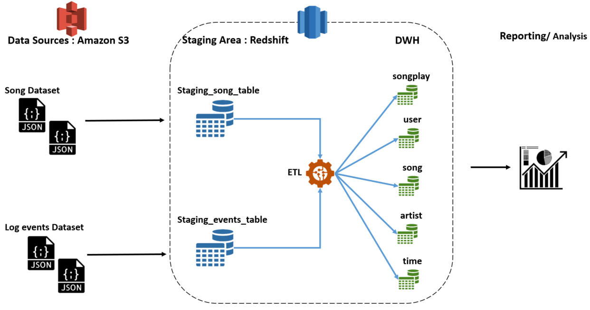

# Data Warehouse with Amazon Redshift
In this project, we will explain how to build an ETL pipeline that extracts data from S3 buckets, stages them in Redshift, and transforms data into a set of dimensional and fact tables for analytics of Sparkify streaming musics application, using AWS SDK for Pyhton language programming.
Below the digram that explain the pipeline process 

Different steps will be taken in this project:
- Set [dwh.cfg](https://github.com/Iaddiop/Cloud_Data_Warehouse/blob/master/dwh.cfg) file to define all parameters that we need to create and connect to the Redshift cluster and to the S3 buckets
- create python script that will [create tables](https://github.com/Iaddiop/Cloud_Data_Warehouse/blob/master/create_tables.py) fact and dimension for the star schema in Redshift.
- Build SQL statements that will be used to insert data into tables : [sql_queries.py](https://github.com/Iaddiop/Cloud_Data_Warehouse/blob/master/sql_queries.py)
- Build an ETL pipeline to process data from the S3 log files to the Sparkify database on Redshift.
- Finally, data integration testing the tables in the database.

## Data Sources :
The data stored in 2 datasets that reside in S3 :
- [Song_data](s3://udacity-dend/song_data) : JSON files covered the main activities fo the users of the music app
- [Log_data](s3://udacity-dend/log_data) : JSON metadata about users
And the log data [json path](s3://udacity-dend/log_json_path.json)

## Data modeling :
We will use the relational database to modeling the data and the star schema concept, like this :

- **Fact Table**

**- songplays** : song plays (we will filtring data for page == NextSong), have these columns :
songplay_id, start_time, user_id, level, song_id, artist_id, session_id, location, user_agent

- **Dimension Tables**

**- users** : users table have this columns : user_id, first_name, last_name, gender, level

**- songs** : songs, have these columns : song_id, title, artist_id, year, duration

**- artists** : artists, have these columns : artist_id, name, location, latitude, longitude

**- time** : timestamps of records in songplays broken down into specific units, have these columns : start_time, hour, day, week, month, year, weekday

Please check `sql_queries.py` to see the details of data type of each columns in the tables.
To learn more about [Redshift Data Types](https://docs.aws.amazon.com/redshift/latest/dg/c_Supported_data_types.html).

## How to run this project :
To run this project, please folowing the below steps :
1 - Create Redshift cluster : run the Jupyter Notebook `Creating Redshift Cluster.ipynb`
2 - Create tables : run `create_table.py`
3 - Then lanch the etl script : run `etl.py` to process data (extract, transform and insert data to the tables)
4 - To test the integration of the data : run `Test.ipynb` on Jupyter Notebook

## The expected results :
**- songplays** : 333 rows
**- users** : 105 rows
**- songs** : 14896 rows
**- artists** : 10025 rows
**- time** : 333 rows
### References :
- Convert timestamp : https://stackoverflow.com/questions/39815425/how-to-convert-epoch-to-datetime-redshift
